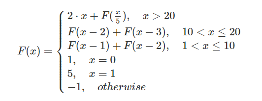
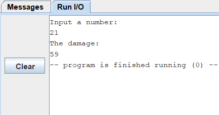
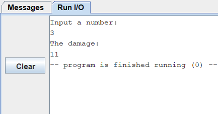
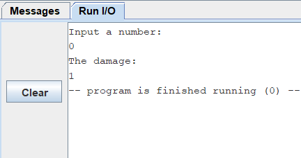
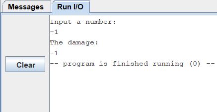

# ALCO_project1
## Introduction
- You can see complete introduction in this [LINK](https://hackmd.io/@wycchen/1102ALCO_project1)
- Write a program to fix below function 

## Documentation
  ### Write a recursive function called `func` to fix above question.
   #### Detail functions as following:
**1. Define some strings `Input` and `Output` in order to be easier to use later**

    .data 	
      Input:	.string "Input a number:\n"
      Output:	.string "The damage:\n" 
    .text
   
**2. Put 21, 11, 1 and 5 into redister x18, x19, x20, and x21 respectively**
   - Using 21 and 11 instead of 20 and 10 because in RISC-V instruction we only can use **blt** (branch if less than). I converted the range from `1<x<=10` to `1<x<11` , from `10<x<=20` to `10<x<21` and from `x>20` to `x>=21`
   - x22 as a register that put result of F(x) and set x22 as 0
   - **Note:** In this simulator, it has **ble** (branch if less or equal)

          main:
            addi x18,x0,21	#put 21 into x18
            addi x19,x0,11	#put 11 into x19
            addi x20,x0,1	#put 1 into x20
            addi x21,x0,5	#put 5 into x21
            addi x22,x0,0	#result
**3. Print String `Intput` and store input number into a0**

    #in main
    la a0, Input	
    li a7,4		#4 PrintStirng
    ecall
    li a7,5		#5 ReadInt,stored in a0
    ecall
**4. Call recursive function (branch to `func`)**
    
    #in main
    jal x1 func		#call recursive func

**5. If x meets the condition branch to correspond label**

    func:			#x is input number stored in a0
        blt a0,x0,else	#if(x<0) branch to else
        beq a0,x0,xeq0	#if(x==0) branch to xeq0
        beq a0,x20,xeq1 	#if(x==1) branch to xeq1
        blt a0,x19,xle10	#if(x<11) branch to xle10. range (1<x<=10) equal 1<x<11
        blt a0,x18,xle20	#if(x<21) branch to xle20. range (10<x<=20) equal 10<x<21
        bge a0,x18,xbg20	#if(x>=21) branch to xbg20
**6. Details of each label**
  - If x doesn't match above conditions, branch to label `else`
   
        #otherwise
        else: 
            addi x22,x22,-1	#return -1
            jalr x0,0(x1)
  - If x is equal to 0, branch to label `xeq0`
    
        #x=0
        xeq0:
            addi x22,x22,1	#return 1
            jalr x0,0(x1)
  - If x is equal to 1, branch to label `xeq1`
    
        #x=1
        xeq1:
            addi x22,x22,5	#return 5
            jalr x0,0(x1)
   - If x is greater than 1 and less than 11,  branch to label `xle10`
   - If x is greater than 10 and less than 21 (is the same but change argument of function call),  branch to label `xle20`

            #1<x<=10 -> 1<x<11
            #10<x<=20 -> 10<x<=21 
            xle10:
              addi  sp, sp, -8	#allocate space for saved register
              sw    x1, 0(sp)	#store x1(return address)   
              sw    a0, 4(sp)	#store origin x   
              addi  a0, a0, -1	#x-1
              jal   x1, func	#call func(x-1)

              lw    x26, 4(sp)   #load origin x into x26
              sw    a0,4(sp)    	#store result of func(x-1) into stack
              addi  a0, x26, -2	#x-2  
              jal   x1, func 	#call func(x-2)
              lw    x26,4(sp)	#load result of func(x-1) into x26
              add   a0,a0,x26	#func(x-1)+func(x-2)
              lw    x1,0(sp)	#load x1
              addi  sp,sp,8	#Deallocate space for saved register
              jalr  x0,0(x1)	#return first call func(x)
   - If x is greater than 21, branch to label `xbg20`

        #x>20 -> x>=21
        xbg20:
            addi  sp, sp, -8      
            sw    x1, 0(sp)        
            sw    a0, 4(sp)
            slli  x22,a0,1	#x22=2*x

            div   a0, a0, x21	#x/5 
            jal   x1, func	#call func(x/5)
            sw    a0,4(sp) 
            add   a0,a0,x22	#func(x/5)+2*x
            lw    x1,0(sp)
            addi  sp,sp,8
            jalr  x0,0(x1)
**7. Finish recursive function**
   - Back to the first call `func` address
   - Print String `Output`
   - Print result
   - exit
  
    #in main
    la a0,Output	
    li a7,4		#4 PrintStirng
    ecall
    mv a0,x22       #move x22(result) into a0
    li a7,1		#1 printint
    ecall
    li a7,10        #10 exit
    ecall

## Technique used
- RISC-V -> assembly language
- rars.jar -> devolopment environment
  - Download [rars.jar](https://github.com/TheThirdOne/rars/releases/tag/continuous)
  - [RISC-V Simulator](https://github.com/TheThirdOne/rars)  source code

## How to run code
- Download [rars.jar](https://github.com/TheThirdOne/rars/releases/tag/continuous)
  -  You will need at least Java 8 to run it. ([download](https://www.java.com/zh-TW/download/))
- Download [alco_project1.asmc](https://github.com/yolu21/ALCO_project1/blob/main/alco_project1.asm)
- Import "**alco_project1.asmc**" into rars.jar
- Click the button like tool
  -  
- If it assembled correct, two green buttons will light up
  - The first green button is all executed, the second green button is executed line by line
  - 

## Sample Output Screenshot
- x > 20
  - 
- 10 < x <= 20
  - 
- 1 < x <= 10
  - 
- x = 0
  - 
- x = 1
  - 
- otherwise
  - 
