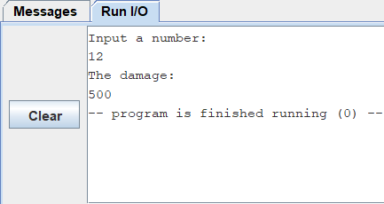

# ALCO_project1
## Introduction
- You can see complete introduction in this [LINK](https://hackmd.io/@wycchen/1102ALCO_project1).
## Sample Screenshot
- x=1
  - 
- x=0
  - 
- 1<x<=10
  - 
- 10<x<=20
  - 
- x>20
  - 
- otherwise
  -  
